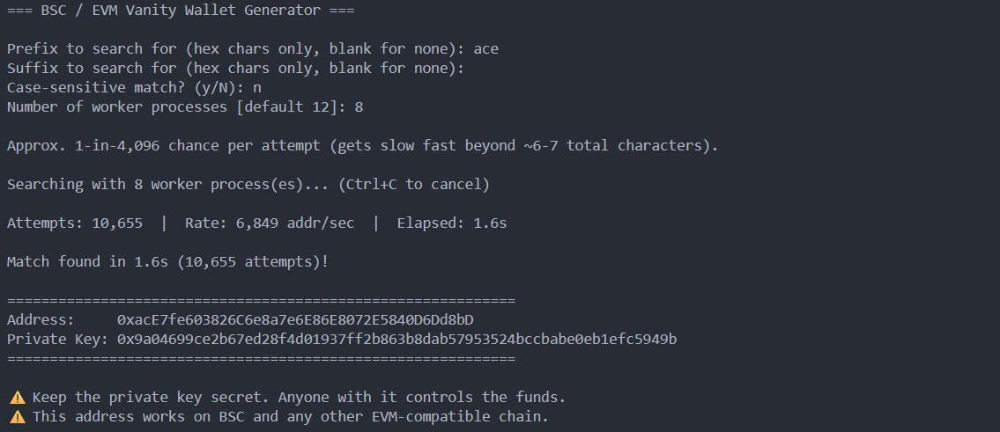

# EVM Vanity Wallet Generator

A simple Python vanity wallet generator for EVM-compatible chains.

The generated wallet uses a standard Ethereum-style EVM address, so the same address can be used on:

- **Ethereum**
- **BNB Chain**
- **Polygon**
- **Avalanche**
- **Arbitrum**
- **Optimism**
- **Fantom**

> The script itself does not connect to any blockchain. It generates the wallet locally. You can use the resulting address on any of the EVM chains above.

## Features

- Search for a custom **prefix** and/or **suffix**
- Optional case-sensitive matching
- Uses multiple CPU processes for faster searching
- Private key is generated locally
- Can save the result to a local text file

## Requirements

- Python 3.8+
- `eth-account`

## Installation

Clone or download the project, then install the dependency:

```bash
pip install -r requirements.txt
```

On systems where `pip` requires it:

```bash
pip3 install -r requirements.txt
```

## Usage

Run:

```bash
python3 bsc_vanity_wallet.py
```

You will be asked for:

1. **Prefix** — characters the address should start with
2. **Suffix** — characters the address should end with
3. **Case sensitivity** — choose `y` for case-sensitive matching
4. **Worker processes** — number of CPU processes to use

Example:

```text
=== BSC / EVM Vanity Wallet Generator ===

Prefix to search for (hex chars only, blank for none): dead
Suffix to search for (hex chars only, blank for none):
Case-sensitive match? (y/N): n
Number of worker processes [default 8]:
```

Only hexadecimal characters are allowed:

```text
0-9
a-f
A-F
```

### Example Result



## Important Security Note

The private key gives complete control over the wallet.

- **Never share the private key.**
- Do not paste it into websites, chats, or untrusted applications.
- If the wallet will hold real funds, consider running the generator on an offline machine.
- Store the private key securely.

## Difficulty

Vanity addresses are found by repeatedly generating random wallets until one matches your requested pattern.

A rough estimate is:

```text
16^(prefix length + suffix length)
```

For example, a 4-character pattern has an approximate 1-in-65,536 chance per attempt.

Longer patterns can take a very long time.

## EVM Compatibility

The generated address is a normal EVM address. It is not tied specifically to BNB Chain despite the script filename.

The same address format is compatible with:

- Ethereum
- BNB Chain
- Polygon
- Avalanche
- Arbitrum
- Optimism
- Fantom

The script generates the wallet locally and does not automatically fund, deploy, or interact with any of these networks.
